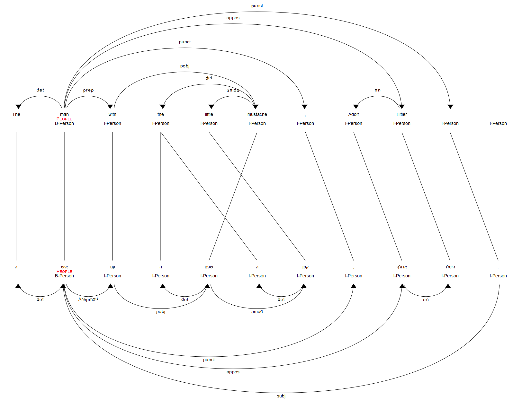
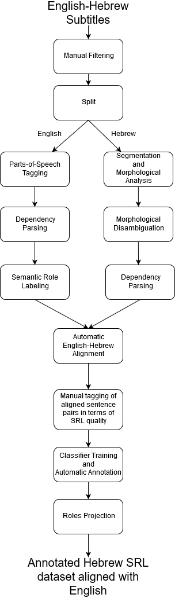

# Building a Hebrew FrameNet Lexical Resource from Parallel Movie Subtitles

## Summary
This work sets out to acquire Hebrew exemplar sentences with FrameNet annotations by projecting annotations from English. To this end, we use the [OpenSubtitles 2016](http://opus.nlpl.eu/OpenSubtitles2016.php) dataset of aligned English-Hebrew subtitles of movies and television shows.

## Contents
This repository contains the following:

* Thesis in PDF format
* Source code for the SRL visualization tool
* Jupyter notebooks for dataset construction, dataset statistics, and feature extraction
* Two sqlite databases: `manual_annotations.sqlite3` (original seed) and `data.sqlite3` (result of classifier annotation on a subset of the dataset)
* The code for the classifier, and a pickled trained classifier

## Aligned SRL Visualization

In order to run the SRL visualization tool, you need:
* Python 3.5 or later (Python 2 not supported)
* `conllu` package to parse CoNLL-U format
* `scikit-learn` and `imbalanced-learn` for the classifier

The best way to get started is to create a new virtual environment (either through Conda or `python3 -m venv <venv name>`), and run `pip install -r requirements.txt`.

## Data

### Statistics

| # of subtitles | # of sentences | # of English tokens | # of Hebrew tokens (before segmentation) | # of Hebrew tokens (after segmentation) | English vocabulary size | Hebrew vocabulary size |
|----------------|----------------|---------------------|------------------------------------------|-----------------------------------------|-------------------------|------------------------|
| 30,789         | 23,062,193     | 194,217,249         | 118,236,346                              | 188,375,525                             | 1,540,672               | 894,759                |

### Processing
The following diagram shows the data pipeline in our work:

### Specifications
The computer used to process the data is an Intel Xeon E5645 @ 2.40 GHz and 24 cores and 128GB RAM.

### Runtime
* English POS-tagging and dependency parsing: less than one day
* Hebrew segmentation, morphological analysis, morphological disambiguation, and dependency parsing using [YAP](https://github.com/habeanf/yap): one month
* Automatic English-Hebrew alignment: one day
* English SRL: one week
* Each of the other parts took a few minutes
